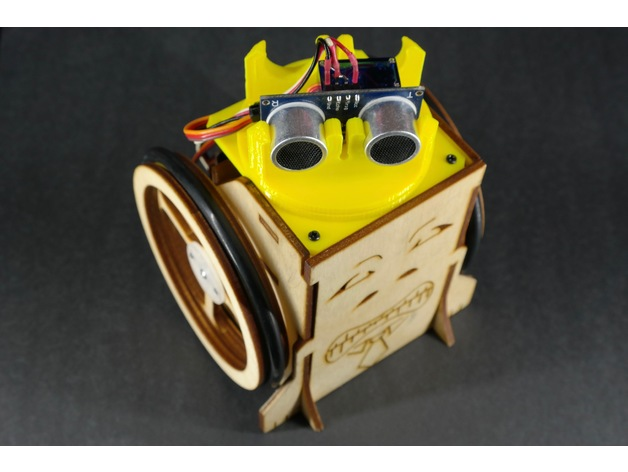
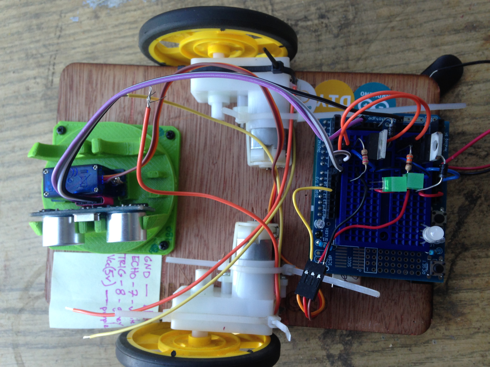
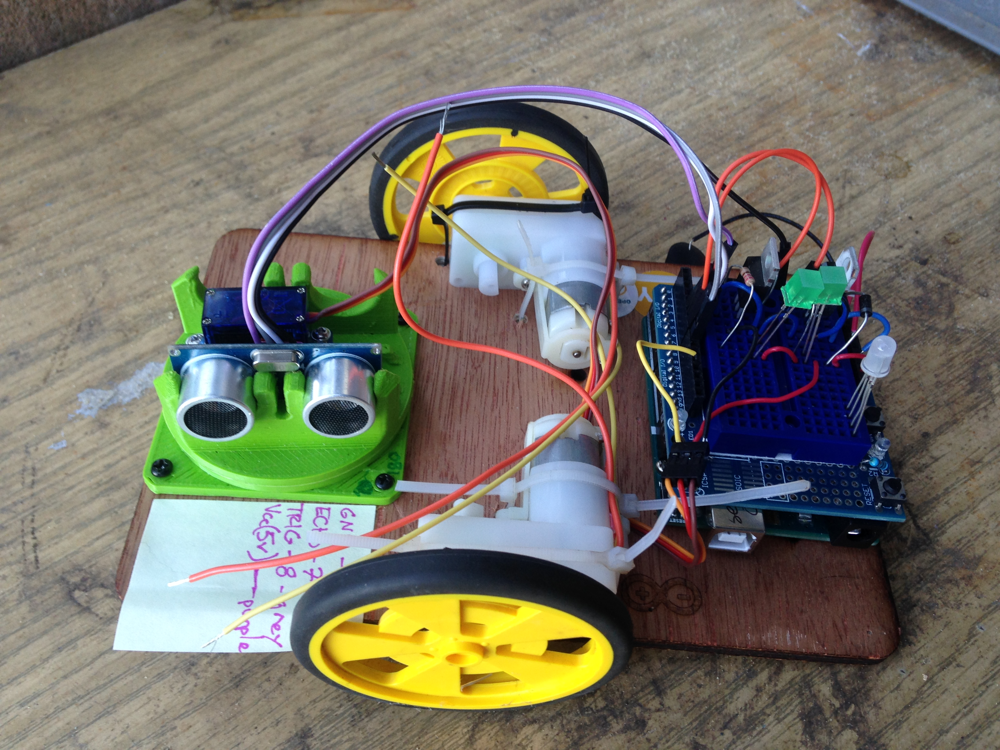
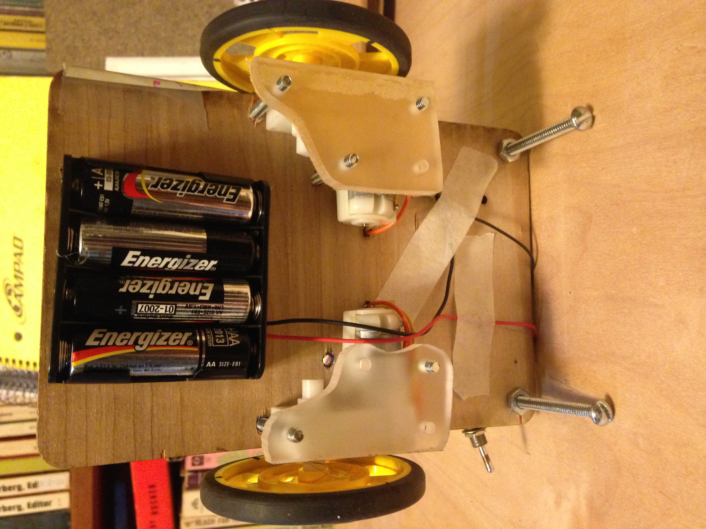
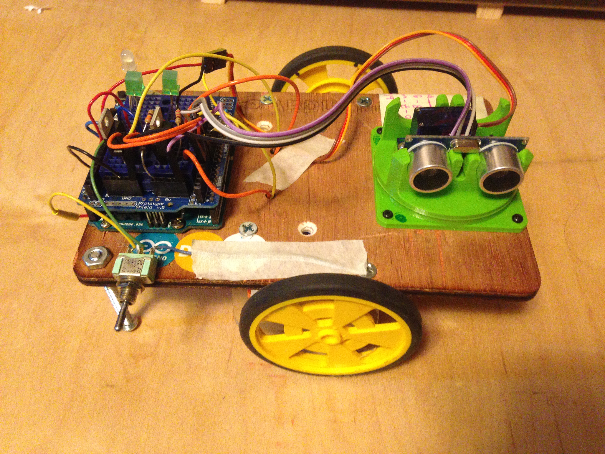
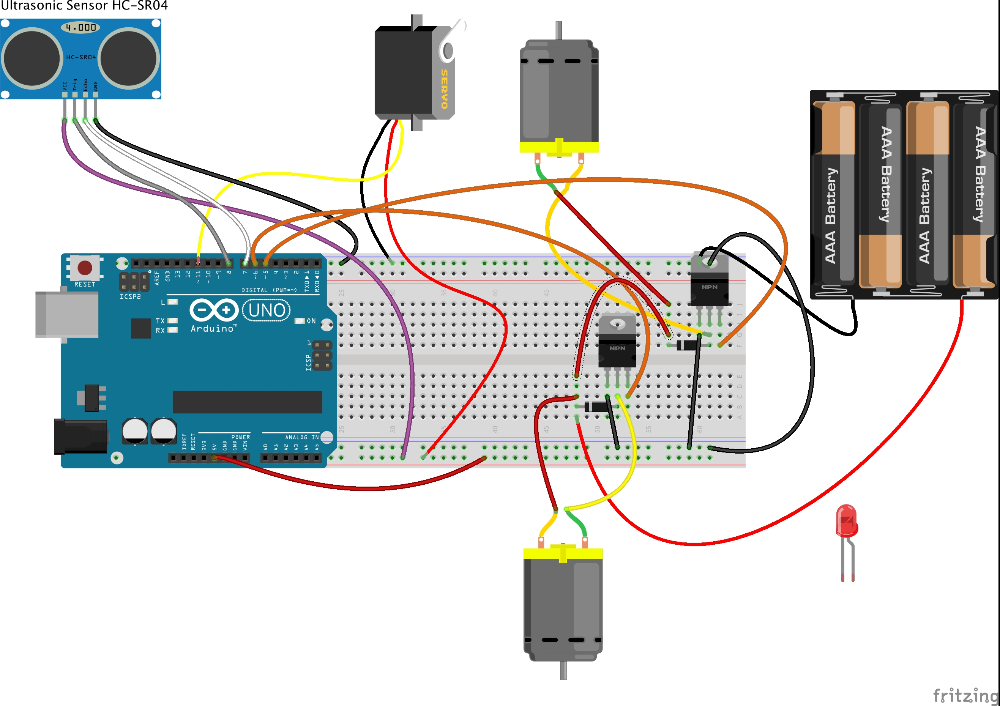

# Midterm Project Documentation Example 

## Harvey - the Shy Robot

### Concept: Create a shy robot. 

I'm not sure yet what that means so for the first few iterations the focus of the project will be getting basic functionality working.
I decided to base the project on a design published in Make Magazine 61:

The key feature of this robot is a simple "ultradar" that is used to sense obstacles in front of the robot. 

Adam Kemp provides the [code](UltraDAR/files/UltraDAR-SingleSweep.ino) (very helpful!) and files to 3D print the parts here: www.thingiverse.com/thing:2481918

[//]: # (comment test: UltraDAR/images/UltraDAR-Top.jpg)

- I printed the ultradar pieces and assembled the mechanism. 
- I tested the servo. [Servo test code](code/ServoTest.ino)
- I tested the ultrasonic sensor. [Ultrasonic test code](code/UltraTest.ino)
- I used a breadboard shield to set up 2 transistors to drive two motors and tested them (first with LEDs)
  - Initially I used zipties to hold the motors in place. Not super secure but easy to move the motors if I needed to (and I did).

I had to move the motors because they were in the way of the ultrasonic sensor. 
I decided against zipties (wasteful) and hot glue (too permanent) to attach the motors to the wooden platform. 
I spent a little extra time to drill holes and cut plates so I could use bolts to hold the motors in place (allowing for repositioning and swapping motors later)

5v from USB wasn't really enough power for the motors. AND I needed the bot to be untethered.
- first I tried a 9V battery: nice and compact and plenty of voltage for the motors
  - it worked great but I knew the amperage draw was too much and the battery wouldn't last long
  - I was running the motors from the regulated 5V so I wasn't taking advantage of the full 9v
- I ended up using 4 AA batteries
  - technically 6v isn't really enough extra voltage to regulate down to 5v, but it works... (Arduino supposedly requires 7v minimum for its onboard regulator)
  - the batteries are heavy and bulky, but I mounted them out of the way on the underside and positioned to counterbalance the weight of the Arduino, etc
- I added a power switch to make it easy to turn the bot on and off

### Initial Functionality:

 - sense obstacles
   - use ultrasonic sensor to detect distance
   - use servo to position ultrasonic sensor so an sweep of sensor readings can be made to map the area in front (and sides) of the bot
 - move forward and turn to avoid obstacles
   -  In this iteration I chose to use DC gearhead motors to drive the robot to keep things simple. But that means that without an H-Bridge I cannot reverse the motors.
   - Adam Kemp used continuous rotation servos, which can be reversed more easily. 
 

 In this video we see the problem with using Adam's code and not being able to reverse: 
 when the bot is too close to an obstacle the code sends a flag which would reverse the bot, but my modified code ignores the reverse flag and drives forward instead.
 
 https://youtu.be/EkJ2UbEyxtQ
 
 But as long as the bot doesn't get too close to anything, it does pretty well! 
 
 I don't know that Fritzing is the best way to present this info (without lots of nitpicking), but here's a schematic of Harv v2
 
 
### Challenges

 - one of my drive motors is stronger than the other, so I had to use analogWrite to vary the speed of one motor to match the other. 
   - I could have done a better job of matching with PWM or pulled the motors to see if there's another pair that would work better.
 - it turns out you can't use PWM on pins 9 & 10 if you use the Servo library, so that's something to consider in the future. I had to move my motor drive control to pins 5 & 6.
 - for a while I thought the ultrasonic sensor had burned out, but a wire had just come loose. I thought I had checked all the connections but apparently not. 
 	When I tested with a brand new sensor (always have 2!) I found the same problem. It turned out one of the connections on the Arduino side was loose.
 

### Next Steps / Future Functionality:

 - Create a PCB for a permanent version of the hardware, so I can play with code without worrying about wires popping loose!

 - H-Bridge and reverse-ability
   - or continuous rotation servos
   
 - faster forward motion
 
 - a sound sensor that would
 	- make the bot move away from sound (this seems a bit tough to do well: sound localization)
 		- http://42bots.com/showcase/experimenting-with-sound-localization-and-arduino/
 		- http://forum.arduino.cc/index.php?topic=55578.0
 		- https://www.rs-online.com/designspark/diy-sound-localization-sensor-using-arduino
 	- respond to sound by driving quickly forward
 	  -  I like the idea that sometimes this might make the bot run into obstacles after getting "scared" by a loud sound
 	  
 - Other possible shy functionality/behavior
   - hiding under tables
   - seeking out dark places
   - emerging only when people are not around (or only if they're very still and quiet)
     - How is Harv going to be different from a Roomba?
     - Before I go too far down the road of reinventing the wheel, maybe I should think about starting with a Roomba as the base unit...
   
 	  
 	  
 	  
